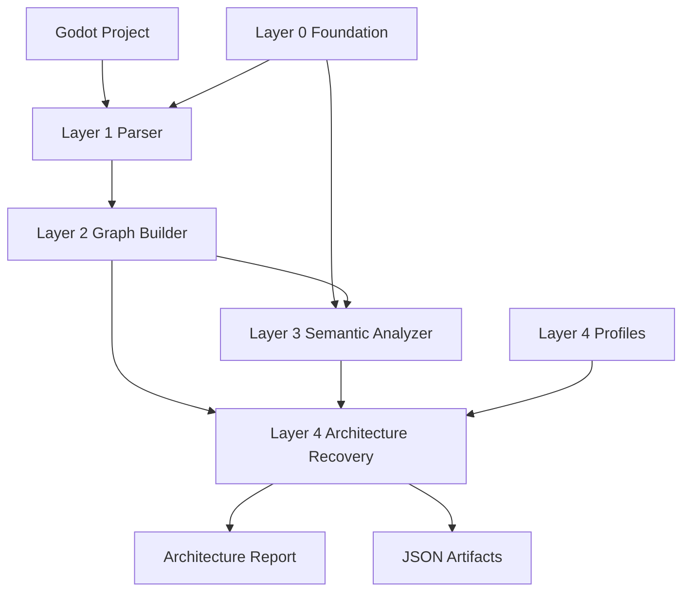

# Godot Project Analysis Powerup

面向 Codex 的 Godot 项目静态分析与架构恢复 skill pack。

这个项目把 Godot 项目分析拆成 Layer 0 到 Layer 4 五个独立 skill，并额外提供一个总调度 skill `godot-project-analysis`。用户安装后，可以在 Codex 里用一句话驱动完整分析流程，也可以按层单独重跑解析、图构建、语义分析或架构报告。

## 目标

本项目用于帮助 Codex 对 Godot 4.x 项目做可追溯的静态分析，输出面向人类阅读的架构恢复报告。

它重点解决几个问题：

- 快速盘点 Godot 项目的场景、脚本、资源、autoload、输入动作和依赖关系。
- 把 `.tscn`、`.gd`、`project.godot` 等静态事实整理成统一关系图。
- 在不污染前置层的前提下识别 UI、Gameplay、Manager、Data、Core 等系统结构。
- 在 Layer 4 基于证据恢复项目身份、玩家主循环、玩家控制方式、核心模块职责、风险和建议。
- 让 Codex 可以通过 skill 自动选择正确流程，而不是每次手工拼命令。

## 当前架构

项目由 6 个 skill 组成：

```text
godot-project-analysis-powerup/
  install.ps1
  install.sh
  README.md

  godot-project-analysis/          # 总调度入口 skill
  godot-analysis-foundation/       # Layer 0
  godot-analysis-parser/           # Layer 1
  godot-analysis-graph/            # Layer 2
  godot-analysis-semantic/         # Layer 3
  godot-analysis-architecture/     # Layer 4

  configs/
    layer4_profiles/               # 开发态 profile 配置

  analysis/                        # 本地分析输出示例和测试结果
  docs/                            # 开发计划和整改记录
```

### 为什么是 5 个 Layer skill + 1 个总调度 skill

五个 Layer skill 保持独立，是为了让每一层职责清晰、可单独验证、可单独升级。

`godot-project-analysis` 是用户入口，负责把五层串起来。用户通常只需要触发这个入口 skill；只有在调试或局部重跑时，才需要直接使用某一个 Layer skill。

这样的结构有几个好处：

- 用户使用简单：只记 `godot-project-analysis`。
- 开发维护稳定：Layer 1 到 Layer 3 可以保持领域中立，Layer 4 单独负责领域推断。
- 上下文更小：Codex 只在需要时读取对应 skill。
- 回归风险可控：某层改动可以只跑对应层测试和下游验证。

## 分层说明

### Layer 0: Foundation

目录：

```text
godot-analysis-foundation/
```

职责：

- 提供 Godot 4.x 类、API、节点角色、系统类别和模式规则的基础语义。
- 生成或复用标准 foundation artifacts。
- 不分析具体项目。

主要输出：

```text
foundation_semantics.json
api_semantics.json
pattern_rules.json
role_taxonomy.json
foundation_build_report.md
```

常用命令：

```powershell
python "$env:USERPROFILE\.codex\skills\godot-analysis-foundation\scripts\build_foundation.py" --output analysis\layer0
python "$env:USERPROFILE\.codex\skills\godot-analysis-foundation\scripts\validate_foundation.py" --input analysis\layer0
```

通常情况下不需要每次重建 Layer 0。默认 foundation 已经打包在：

```text
godot-analysis-foundation/assets/default-layer0/
```

### Layer 1: Parser

目录：

```text
godot-analysis-parser/
```

职责：

- 解析具体 Godot 项目的静态事实。
- 读取 `project.godot`、`.tscn`、`.gd`、`.tres`、`.res`。
- 提取入口场景、场景树、脚本信息、autoload、输入动作、资源引用、信号连接、依赖关系。
- 保持事实层，不做架构判断。

主要输出：

```text
project_inventory.json
scene_parse.json
script_parse.json
dependency_extract.json
parser_report.md
```

常用命令：

```powershell
python "$env:USERPROFILE\.codex\skills\godot-analysis-parser\scripts\parse_godot_project.py" `
  --project "D:\godot\project\my-game" `
  --output analysis\my_game\layer1 `
  --layer0 analysis\my_game\layer0 `
  --resource-mode referenced

python "$env:USERPROFILE\.codex\skills\godot-analysis-parser\scripts\validate_layer1.py" `
  --input analysis\my_game\layer1
```

### Layer 2: Graph

目录：

```text
godot-analysis-graph/
```

职责：

- 基于 Layer 1 的静态事实构建统一关系图。
- 标准化 Scene、Node、Script、Resource、Signal、Autoload、Project 等节点。
- 标准化 contains、attaches、instantiates、references、connects、emits、transitions_to 等边。
- 显式保留 unresolved 边，不静默吞掉问题。

主要输出：

```text
input_readiness.json
input_readiness_report.md
graph.json
graph_index.json
graph_stats.json
graph_build_report.md
```

常用命令：

```powershell
python "$env:USERPROFILE\.codex\skills\godot-analysis-graph\scripts\preflight_layer2.py" `
  --layer0 analysis\my_game\layer0 `
  --layer1 analysis\my_game\layer1 `
  --output-json analysis\my_game\layer2\input_readiness.json `
  --output-md analysis\my_game\layer2\input_readiness_report.md

python "$env:USERPROFILE\.codex\skills\godot-analysis-graph\scripts\build_graph.py" `
  --layer1 analysis\my_game\layer1 `
  --output analysis\my_game\layer2

python "$env:USERPROFILE\.codex\skills\godot-analysis-graph\scripts\validate_graph.py" `
  --input analysis\my_game\layer2
```

### Layer 3: Semantic

目录：

```text
godot-analysis-semantic/
```

职责：

- 基于 Layer 0 和 Layer 2 做中立语义分析。
- 标注实体的系统类别、语义角色、模式匹配和置信度。
- 可暴露原始领域词、命名 token 和事实证据，但不做领域候选和领域判断。
- 为 Layer 4 提供系统聚类和语义证据。

主要输出：

```text
semantic_annotations.json
systems.json
pattern_matches.json
semantic_findings.json
semantic_report.md
```

常用命令：

```powershell
python "$env:USERPROFILE\.codex\skills\godot-analysis-semantic\scripts\analyze_semantics.py" `
  --layer0 analysis\my_game\layer0 `
  --layer2 analysis\my_game\layer2 `
  --output analysis\my_game\layer3

python "$env:USERPROFILE\.codex\skills\godot-analysis-semantic\scripts\validate_semantics.py" `
  --input analysis\my_game\layer3 `
  --layer0 analysis\my_game\layer0
```

### Layer 4: Architecture

目录：

```text
godot-analysis-architecture/
```

职责：

- 基于 Layer 2 图和 Layer 3 语义结果恢复项目架构。
- 生成面向人类阅读的中文架构报告。
- 推断项目身份、玩家主循环、玩家控制方式、核心玩法逻辑、模块职责、场景流程、风险和建议。
- 这是唯一允许做领域推断的层。

主要输出：

```text
architecture_summary.json
architecture_report.md
findings.json
risks.json
recommendations.json
profile_evaluation.json
project_identity.json
gameplay_loop.json
module_responsibilities.json
```

Layer 4 内置多 profile 配置：

```text
godot-analysis-architecture/assets/layer4_profiles/
```

这些 profile 用于泛化的项目身份识别，例如 card、rpg、tactical、survival、management、story、sandbox 等。它们不应该写进 Layer 1 到 Layer 3。

常用命令：

```powershell
python "$env:USERPROFILE\.codex\skills\godot-analysis-architecture\scripts\recover_architecture.py" `
  --layer2 analysis\my_game\layer2 `
  --layer3 analysis\my_game\layer3 `
  --output analysis\my_game\layer4 `
  --profile-dir "$env:USERPROFILE\.codex\skills\godot-analysis-architecture\assets\layer4_profiles"

python "$env:USERPROFILE\.codex\skills\godot-analysis-architecture\scripts\validate_architecture.py" `
  --input analysis\my_game\layer4

python "$env:USERPROFILE\.codex\skills\godot-analysis-architecture\scripts\quality_gate_architecture.py" `
  --layer3 analysis\my_game\layer3 `
  --layer4 analysis\my_game\layer4
```

### Godot Project Analysis Orchestrator

目录：

```text
godot-project-analysis/
```

职责：

- 作为用户面对 Codex 时的统一入口。
- 自动定位五个 Layer skill。
- 自动按顺序执行 Layer 0 到 Layer 4。
- 支持从指定层开始重跑。
- 自动使用 Layer 4 内置 profile。
- 自动执行每层 validation 和 Layer 4 quality gate。

入口脚本：

```text
godot-project-analysis/scripts/run_full_analysis.py
```

## 安装

### Windows

在项目根目录执行：

```powershell
powershell -ExecutionPolicy Bypass -File .\install.ps1
```

默认安装到：

```text
C:\Users\<user>\.codex\skills
```

如果设置了 `CODEX_HOME`，则安装到：

```text
$CODEX_HOME\skills
```

### Linux / macOS

在项目根目录执行：

```bash
chmod +x ./install.sh
./install.sh
```

默认安装到：

```text
~/.codex/skills
```

如果设置了 `CODEX_HOME`，则安装到：

```text
$CODEX_HOME/skills
```

## 在 Codex 中触发

安装后，最推荐的方式是在 Codex 对话里直接说：

```text
用 godot-project-analysis 分析 D:\godot\project\my-game
```

或者：

```text
用 godot-project-analysis 分析 D:\godot\WarCanvas-master
```

Codex 会根据 skill 名称自动加载 `godot-project-analysis`，再由它协调五层分析。

也可以触发单层 skill：

```text
用 godot-analysis-parser 解析 D:\godot\project\my-game
```

```text
用 godot-analysis-architecture 基于已有 layer2 和 layer3 重跑架构报告
```

一般用户只需要使用 `godot-project-analysis`。单层 skill 更适合开发、调试和回归验证。

## 命令行使用

### 完整分析

```powershell
python "$env:USERPROFILE\.codex\skills\godot-project-analysis\scripts\run_full_analysis.py" `
  --project "D:\godot\project\my-game"
```

默认输出：

```text
analysis/<project_slug>/
```

### 指定输出目录

```powershell
python "$env:USERPROFILE\.codex\skills\godot-project-analysis\scripts\run_full_analysis.py" `
  --project "D:\godot\project\my-game" `
  --output "analysis\my_game"
```

### 从某一层开始重跑

完整重跑：

```powershell
python "$env:USERPROFILE\.codex\skills\godot-project-analysis\scripts\run_full_analysis.py" `
  --project "D:\godot\project\my-game" `
  --output "analysis\my_game" `
  --start-layer 0
```

只重跑 Layer 1 到 Layer 4：

```powershell
python "$env:USERPROFILE\.codex\skills\godot-project-analysis\scripts\run_full_analysis.py" `
  --project "D:\godot\project\my-game" `
  --output "analysis\my_game" `
  --start-layer 1
```

只重跑 Layer 4：

```powershell
python "$env:USERPROFILE\.codex\skills\godot-project-analysis\scripts\run_full_analysis.py" `
  --project "D:\godot\project\my-game" `
  --output "analysis\my_game" `
  --start-layer 4
```

`--start-layer 4` 要求已有：

```text
analysis/my_game/layer2/
analysis/my_game/layer3/
```

### 常用参数

```text
--project          Godot 项目根目录，必须包含 project.godot
--output           输出目录，默认 analysis/<project_slug>
--start-layer      从哪一层开始执行，0 到 4
--profile-dir      自定义 Layer 4 profile 目录
--exclude-addons   Layer 1 解析时排除 res://addons
--resource-mode    referenced 或 all
--rebuild-layer0   强制重建 Layer 0
--skip-validation  跳过每层 validation，不推荐常规使用
```

## 输出目录

默认输出结构：

```text
analysis/<project_slug>/
  layer0/
    foundation_semantics.json
    api_semantics.json
    pattern_rules.json
    role_taxonomy.json
    foundation_build_report.md

  layer1/
    project_inventory.json
    scene_parse.json
    script_parse.json
    dependency_extract.json
    parser_report.md

  layer2/
    input_readiness.json
    input_readiness_report.md
    graph.json
    graph_index.json
    graph_stats.json
    graph_build_report.md

  layer3/
    semantic_annotations.json
    systems.json
    pattern_matches.json
    semantic_findings.json
    semantic_report.md

  layer4/
    architecture_summary.json
    architecture_report.md
    findings.json
    risks.json
    recommendations.json
    profile_evaluation.json
    project_identity.json
    gameplay_loop.json
    module_responsibilities.json
```

其中最常看的文件是：

```text
analysis/<project_slug>/layer4/architecture_report.md
```

## 数据流



## 分层边界原则

这个项目最重要的设计约束是：

```text
Layer 1 到 Layer 3 保持领域中立。
只有 Layer 4 可以做领域推断。
```

具体含义：

- Layer 1 可以提取文件名、类名、函数名、资源路径、输入动作等原始事实。
- Layer 2 可以把这些事实变成图节点和边。
- Layer 3 可以识别 UI、Gameplay、Manager、Data 等中立系统，也可以保留领域词 token。
- Layer 3 不应该输出“这是卡牌游戏”“这是战术策略游戏”这类领域判断。
- Layer 4 可以基于 profile 和证据做项目身份、玩家主循环、玩法模块的推断。

这个约束可以避免前置层被某类游戏污染，也能让 Layer 4 的 profile 机制独立演进。

## Profile 配置

开发态 profile 位于：

```text
configs/layer4_profiles/
```

安装态 profile 会被打包到：

```text
godot-analysis-architecture/assets/layer4_profiles/
```

安装脚本会把这些 assets 一起复制到 Codex skills 目录。

当前 profile 示例：

```text
action.json
card.json
city_builder.json
horror.json
idle.json
management.json
multiplayer.json
platformer.json
puzzle.json
racing.json
roguelike.json
rpg.json
sandbox.json
shooter.json
simulation.json
sports.json
stealth.json
story.json
survival.json
tactical.json
```

新增 profile 时建议遵守：

- 不针对单个具体项目硬编码。
- 不把某个游戏样例当成验收标准。
- 使用证据规则、权重、required features 和 loop templates 描述可迁移的领域模式。
- 修改后至少用多个不同类型项目做回归验证。

## 验证和质量门

每层都有自己的 validation。

常规完整流程会自动执行：

```text
Layer 0 validate_foundation.py
Layer 1 validate_layer1.py
Layer 2 validate_graph.py
Layer 3 validate_semantics.py
Layer 4 validate_architecture.py
Layer 4 quality_gate_architecture.py
```

如果你在开发某层，可以单独运行对应测试。

Layer 4 相关测试：

```powershell
python godot-analysis-architecture\scripts\test_layer4_profiles.py
python godot-analysis-architecture\scripts\test_architecture_recovery.py
```

Parser 测试：

```powershell
python godot-analysis-parser\scripts\test_parse_godot_project.py
```

Graph 测试：

```powershell
python godot-analysis-graph\scripts\test_build_graph.py
```

Semantic 测试：

```powershell
python godot-analysis-semantic\scripts\test_semantic_analyzer.py
```

## 推荐开发流程

### 修改 Layer 1

1. 修改 parser。
2. 跑 parser 单元测试。
3. 用至少一个真实项目重跑 Layer 1。
4. 从 Layer 2 开始跑下游验证。

```powershell
python "$env:USERPROFILE\.codex\skills\godot-project-analysis\scripts\run_full_analysis.py" `
  --project "D:\godot\project\my-game" `
  --output "analysis\my_game" `
  --start-layer 1
```

### 修改 Layer 2

1. 修改 graph builder 或 preflight。
2. 跑 graph 测试。
3. 从 Layer 2 开始重跑。
4. 检查 unresolved、graph stats 和 Layer 3/Layer 4 是否仍通过。

```powershell
python "$env:USERPROFILE\.codex\skills\godot-project-analysis\scripts\run_full_analysis.py" `
  --project "D:\godot\project\my-game" `
  --output "analysis\my_game" `
  --start-layer 2
```

### 修改 Layer 3

1. 确认没有引入领域判断。
2. 跑 semantic 测试。
3. 从 Layer 3 开始重跑。
4. 检查 Layer 4 报告是否更稳定，而不是更武断。

```powershell
python "$env:USERPROFILE\.codex\skills\godot-project-analysis\scripts\run_full_analysis.py" `
  --project "D:\godot\project\my-game" `
  --output "analysis\my_game" `
  --start-layer 3
```

### 修改 Layer 4 或 profiles

1. 修改 architecture 脚本或 profile。
2. 跑 Layer 4 单元测试。
3. 至少用多个不同项目只重跑 Layer 4。
4. 检查 `profile_evaluation.json`、`project_identity.json` 和 `architecture_report.md`。

```powershell
python "$env:USERPROFILE\.codex\skills\godot-project-analysis\scripts\run_full_analysis.py" `
  --project "D:\godot\project\my-game" `
  --output "analysis\my_game" `
  --start-layer 4
```

## 常见问题

### Codex 没有自动触发 skill

在请求里明确写 skill 名：

```text
用 godot-project-analysis 分析 D:\godot\project\my-game
```

如果仍未触发，检查是否安装到了正确目录：

```text
C:\Users\<user>\.codex\skills\godot-project-analysis\SKILL.md
```

### 报错找不到 project.godot

`--project` 必须指向 Godot 项目根目录，而不是某个子目录。

正确：

```text
D:\godot\project\my-game
```

该目录下应存在：

```text
D:\godot\project\my-game\project.godot
```

### 只想更新最终报告

如果 Layer 2 和 Layer 3 已经存在，可以只重跑 Layer 4：

```powershell
python "$env:USERPROFILE\.codex\skills\godot-project-analysis\scripts\run_full_analysis.py" `
  --project "D:\godot\project\my-game" `
  --output "analysis\my_game" `
  --start-layer 4
```

### Mermaid 图在 Markdown 里显示成文本

这通常不是报告生成问题，而是 Markdown 预览器不支持 Mermaid。

在 VS Code 中可以安装支持 Mermaid 的 Markdown 插件，或者使用 GitHub/GitLab 等支持 Mermaid 的渲染环境查看。

### 是否可以跳过 validation

可以使用：

```powershell
--skip-validation
```

但不建议常规使用。这个项目的核心价值之一就是每层都可验证，跳过 validation 会降低报告可信度。

## 当前状态

当前项目已经具备：

- 五层独立 skill。
- 一个总调度 skill。
- Windows 和 Unix 安装脚本。
- Layer4 多 profile 推断能力。
- Layer4 profile assets 打包。
- 完整流水线脚本。
- 按层重跑能力。
- 每层 validation 和 Layer4 quality gate。

后续扩展重点建议放在：

- 增强 Layer 1 对更多 Godot 资源格式和动态加载模式的解析。
- 增强 Layer 2 图查询能力和 unresolved 解释。
- 保持 Layer 3 中立语义稳定。
- 扩展 Layer 4 profiles，但避免为单个项目硬编码。
- 增加更多跨项目回归样例。

