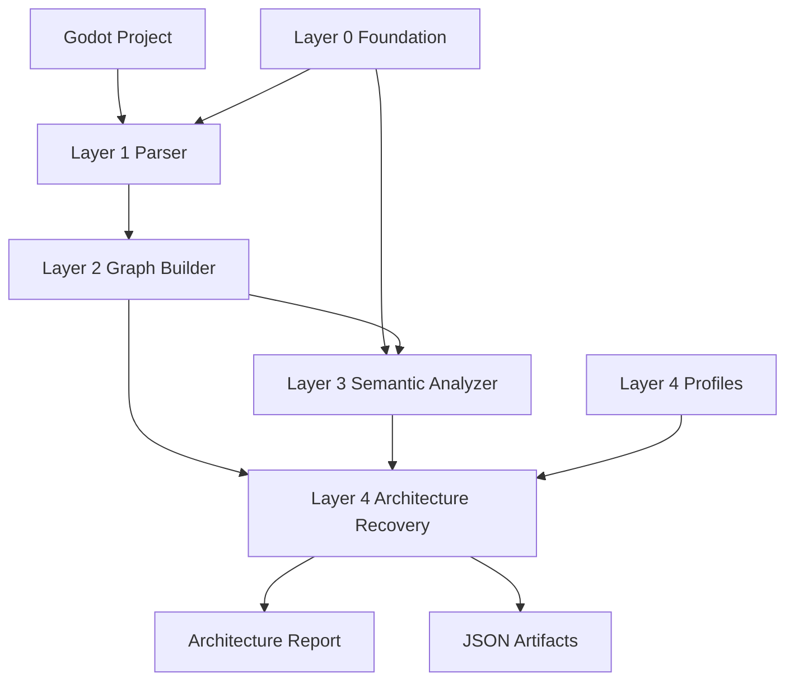

# Godot Project Analysis Powerup

English | [简体中文](README.zh-CN.md)

A Codex skill pack for static Godot project analysis and architecture recovery.

This repository packages a layered Godot analysis harness as Codex skills. It can inventory a Godot project, parse scenes and scripts, build a relationship graph, derive neutral semantic systems, and generate evidence-backed architecture reports.

The default user entry point is the orchestrator skill:

```text
godot-project-analysis
```

After installation, a user can ask Codex:

```text
Use godot-project-analysis to analyze D:\godot\project\my-game
```

Codex will load the orchestrator skill and drive the Layer 0-Layer 4 pipeline.

## Goals

This project helps Codex analyze Godot 4.x projects in a layered, traceable way.

It is designed to:

- Inventory scenes, scripts, resources, autoloads, input actions, and dependencies.
- Normalize `.tscn`, `.gd`, `.tres`, `.res`, and `project.godot` facts into structured artifacts.
- Build a graph of scenes, nodes, scripts, resources, signals, and project-level relationships.
- Identify neutral systems such as UI, Gameplay, Data, Physics, Presentation, Manager, and Core.
- Keep Layer 1-Layer 3 domain-neutral.
- Allow only Layer 4 to perform domain or genre inference.
- Generate human-readable architecture reports with evidence-backed findings, risks, and recommendations.
- Let Codex trigger the correct workflow from a single skill name.

## Repository Layout

```text
godot-project-analysis-powerup/
  README.md
  README.zh-CN.md
  install.ps1
  install.sh

  godot-project-analysis/          # Orchestrator skill
  godot-analysis-foundation/       # Layer 0
  godot-analysis-parser/           # Layer 1
  godot-analysis-graph/            # Layer 2
  godot-analysis-semantic/         # Layer 3
  godot-analysis-architecture/     # Layer 4

  configs/
    layer4_profiles/               # Development-time Layer 4 profiles

  analysis/                        # Local analysis outputs and regression samples
  docs/                            # Development plans and remediation notes
```

## Architecture

The pack contains five layer skills plus one orchestration skill.

```text
godot-project-analysis
  coordinates:
    godot-analysis-foundation
    godot-analysis-parser
    godot-analysis-graph
    godot-analysis-semantic
    godot-analysis-architecture
```

The five layer skills remain independent so each layer can be tested, upgraded, and rerun separately. The orchestrator skill exists for user experience: most users should only need to remember `godot-project-analysis`.

## Data Flow



## Layer Overview

### Layer 0: Foundation

Skill:

```text
godot-analysis-foundation
```

Purpose:

- Provides reusable Godot 4.x semantic foundation data.
- Defines class/API semantics, roles, systems, and pattern rules.
- Does not analyze a concrete project.

Main outputs:

```text
foundation_semantics.json
api_semantics.json
pattern_rules.json
role_taxonomy.json
foundation_build_report.md
```

Layer 0 also ships a default foundation in:

```text
godot-analysis-foundation/assets/default-layer0/
```

### Layer 1: Parser

Skill:

```text
godot-analysis-parser
```

Purpose:

- Extracts static facts from a concrete Godot project.
- Parses `project.godot`, `.tscn`, `.gd`, `.tres`, and `.res`.
- Extracts entry scenes, scene trees, scripts, resources, autoloads, input actions, signals, and dependencies.
- Does not infer architecture.

Main outputs:

```text
project_inventory.json
scene_parse.json
script_parse.json
dependency_extract.json
parser_report.md
```

### Layer 2: Graph

Skill:

```text
godot-analysis-graph
```

Purpose:

- Builds a normalized relationship graph from Layer 1 artifacts.
- Emits nodes such as Scene, Node, Script, Resource, Signal, Autoload, Project, and Unknown.
- Emits edges such as contains, attaches, instantiates, references, connects, emits, transitions_to, and defines_signal.
- Preserves unresolved relationships explicitly.

Main outputs:

```text
input_readiness.json
input_readiness_report.md
graph.json
graph_index.json
graph_stats.json
graph_build_report.md
```

### Layer 3: Semantic

Skill:

```text
godot-analysis-semantic
```

Purpose:

- Interprets the Layer 2 graph using Layer 0 foundation rules.
- Produces neutral semantic annotations, systems, pattern matches, and findings.
- May expose raw names, tokens, and evidence.
- Must not make domain or genre decisions.

Main outputs:

```text
semantic_annotations.json
systems.json
pattern_matches.json
semantic_findings.json
semantic_report.md
```

### Layer 4: Architecture

Skill:

```text
godot-analysis-architecture
```

Purpose:

- Recovers architecture from Layer 2 and Layer 3 artifacts.
- Produces the final human-readable architecture report.
- Infers project identity, player loop, player controls, core gameplay logic, module responsibilities, scene flow, risks, and recommendations.
- This is the only layer allowed to perform domain or genre inference.

Main outputs:

```text
architecture_summary.json
architecture_report.md
findings.json
risks.json
recommendations.json
profile_evaluation.json
project_identity.json
gameplay_loop.json
module_responsibilities.json
```

Layer 4 profiles are bundled in:

```text
godot-analysis-architecture/assets/layer4_profiles/
```

Development copies are also kept in:

```text
configs/layer4_profiles/
```

### Orchestrator: Godot Project Analysis

Skill:

```text
godot-project-analysis
```

Purpose:

- Acts as the user-facing entry point.
- Locates sibling layer skills.
- Runs Layer 0-Layer 4 in order.
- Supports rerunning from a selected layer.
- Uses bundled Layer 4 profiles automatically.
- Runs validation and the Layer 4 quality gate.

Main script:

```text
godot-project-analysis/scripts/run_full_analysis.py
```

## Installation

### Windows

Run from the repository root:

```powershell
powershell -ExecutionPolicy Bypass -File .\install.ps1
```

By default, skills are installed to:

```text
C:\Users\<user>\.codex\skills
```

If `CODEX_HOME` is set, skills are installed to:

```text
$CODEX_HOME\skills
```

### Linux / macOS

Run from the repository root:

```bash
chmod +x ./install.sh
./install.sh
```

By default, skills are installed to:

```text
~/.codex/skills
```

If `CODEX_HOME` is set, skills are installed to:

```text
$CODEX_HOME/skills
```

## Using It From Codex

After installation, ask Codex:

```text
Use godot-project-analysis to analyze D:\godot\project\my-game
```

Other examples:

```text
Use godot-project-analysis to analyze D:\godot\WarCanvas-master
```

```text
Use godot-project-analysis to analyze D:\godot\game\Slay.the.Spire.2.Early.Access
```

To rerun only the final architecture layer:

```text
Use godot-project-analysis to rerun Layer 4 for analysis\my_game
```

To use a single layer directly:

```text
Use godot-analysis-parser to parse D:\godot\project\my-game
```

```text
Use godot-analysis-architecture to rebuild the architecture report from existing Layer 2 and Layer 3 artifacts
```

For normal users, prefer `godot-project-analysis`. Direct layer skills are mostly useful for development, debugging, and regression checks.

## Command Line Usage

### Full Pipeline

```powershell
python "$env:USERPROFILE\.codex\skills\godot-project-analysis\scripts\run_full_analysis.py" `
  --project "D:\godot\project\my-game"
```

Default output:

```text
analysis/<project_slug>/
```

### Custom Output Directory

```powershell
python "$env:USERPROFILE\.codex\skills\godot-project-analysis\scripts\run_full_analysis.py" `
  --project "D:\godot\project\my-game" `
  --output "analysis\my_game"
```

### Rerun From a Layer

Full rerun:

```powershell
python "$env:USERPROFILE\.codex\skills\godot-project-analysis\scripts\run_full_analysis.py" `
  --project "D:\godot\project\my-game" `
  --output "analysis\my_game" `
  --start-layer 0
```

Reparse and rebuild downstream layers:

```powershell
python "$env:USERPROFILE\.codex\skills\godot-project-analysis\scripts\run_full_analysis.py" `
  --project "D:\godot\project\my-game" `
  --output "analysis\my_game" `
  --start-layer 1
```

Rebuild only Layer 4:

```powershell
python "$env:USERPROFILE\.codex\skills\godot-project-analysis\scripts\run_full_analysis.py" `
  --project "D:\godot\project\my-game" `
  --output "analysis\my_game" `
  --start-layer 4
```

`--start-layer 4` requires existing Layer 2 and Layer 3 artifacts:

```text
analysis/my_game/layer2/
analysis/my_game/layer3/
```

### Useful Options

```text
--project          Godot project root containing project.godot
--output           Output directory, defaults to analysis/<project_slug>
--start-layer      First layer to run, 0 through 4
--profile-dir      Custom Layer 4 profile directory
--exclude-addons   Exclude res://addons during Layer 1 parsing
--resource-mode    referenced or all
--rebuild-layer0   Force Layer 0 regeneration
--skip-validation  Skip validation steps
```

## Output Layout

Default output layout:

```text
analysis/<project_slug>/
  layer0/
    foundation_semantics.json
    api_semantics.json
    pattern_rules.json
    role_taxonomy.json
    foundation_build_report.md

  layer1/
    project_inventory.json
    scene_parse.json
    script_parse.json
    dependency_extract.json
    parser_report.md

  layer2/
    input_readiness.json
    input_readiness_report.md
    graph.json
    graph_index.json
    graph_stats.json
    graph_build_report.md

  layer3/
    semantic_annotations.json
    systems.json
    pattern_matches.json
    semantic_findings.json
    semantic_report.md

  layer4/
    architecture_summary.json
    architecture_report.md
    findings.json
    risks.json
    recommendations.json
    profile_evaluation.json
    project_identity.json
    gameplay_loop.json
    module_responsibilities.json
```

The primary human-readable report is:

```text
analysis/<project_slug>/layer4/architecture_report.md
```

## Layer Boundary Rules

The core design rule is:

```text
Layer 1-Layer 3 stay domain-neutral.
Only Layer 4 performs domain inference.
```

In practice:

- Layer 1 may extract names, paths, functions, input actions, resources, and dependencies.
- Layer 2 may normalize those facts into graph nodes and edges.
- Layer 3 may classify neutral systems and preserve raw domain tokens as evidence.
- Layer 3 must not decide that a project is a card game, RPG, tactical game, survival game, and so on.
- Layer 4 may infer project identity and gameplay structure when profile-backed evidence supports it.

This keeps early layers reusable across Godot projects and makes domain reasoning easier to evolve independently.

## Layer 4 Profiles

Layer 4 profiles describe portable evidence patterns for broad project identities and modifiers.

Bundled install-time profiles:

```text
godot-analysis-architecture/assets/layer4_profiles/
```

Development-time profile copies:

```text
configs/layer4_profiles/
```

Current profile examples:

```text
action.json
card.json
city_builder.json
horror.json
idle.json
management.json
multiplayer.json
platformer.json
puzzle.json
racing.json
roguelike.json
rpg.json
sandbox.json
shooter.json
simulation.json
sports.json
stealth.json
story.json
survival.json
tactical.json
```

Profile guidance:

- Do not hard-code a single project.
- Do not tune acceptance criteria around one or two sample games.
- Use portable evidence rules, weights, required features, and loop templates.
- Validate changes against multiple project styles.

## Validation

The orchestrator runs validation after each layer by default.

Validation steps:

```text
Layer 0 validate_foundation.py
Layer 1 validate_layer1.py
Layer 2 validate_graph.py
Layer 3 validate_semantics.py
Layer 4 validate_architecture.py
Layer 4 quality_gate_architecture.py
```

Layer 4 tests:

```powershell
python godot-analysis-architecture\scripts\test_layer4_profiles.py
python godot-analysis-architecture\scripts\test_architecture_recovery.py
```

Parser tests:

```powershell
python godot-analysis-parser\scripts\test_parse_godot_project.py
```

Graph tests:

```powershell
python godot-analysis-graph\scripts\test_build_graph.py
```

Semantic tests:

```powershell
python godot-analysis-semantic\scripts\test_semantic_analyzer.py
```

## Development Workflow

### Updating Layer 1

1. Modify parser behavior.
2. Run parser tests.
3. Re-run from Layer 1 on at least one real project.
4. Confirm downstream Layer 2-Layer 4 validation still passes.

```powershell
python "$env:USERPROFILE\.codex\skills\godot-project-analysis\scripts\run_full_analysis.py" `
  --project "D:\godot\project\my-game" `
  --output "analysis\my_game" `
  --start-layer 1
```

### Updating Layer 2

1. Modify graph or preflight behavior.
2. Run graph tests.
3. Re-run from Layer 2.
4. Check unresolved edges, graph stats, and downstream quality.

```powershell
python "$env:USERPROFILE\.codex\skills\godot-project-analysis\scripts\run_full_analysis.py" `
  --project "D:\godot\project\my-game" `
  --output "analysis\my_game" `
  --start-layer 2
```

### Updating Layer 3

1. Ensure the change does not add domain judgment.
2. Run semantic tests.
3. Re-run from Layer 3.
4. Check that Layer 4 reports become more evidence-backed, not more speculative.

```powershell
python "$env:USERPROFILE\.codex\skills\godot-project-analysis\scripts\run_full_analysis.py" `
  --project "D:\godot\project\my-game" `
  --output "analysis\my_game" `
  --start-layer 3
```

### Updating Layer 4 or Profiles

1. Modify the architecture script or profile JSON.
2. Run Layer 4 tests.
3. Re-run Layer 4 across multiple projects.
4. Review `profile_evaluation.json`, `project_identity.json`, and `architecture_report.md`.

```powershell
python "$env:USERPROFILE\.codex\skills\godot-project-analysis\scripts\run_full_analysis.py" `
  --project "D:\godot\project\my-game" `
  --output "analysis\my_game" `
  --start-layer 4
```

## Troubleshooting

### Codex Does Not Trigger the Skill

Mention the skill name explicitly:

```text
Use godot-project-analysis to analyze D:\godot\project\my-game
```

Then check that the installed file exists:

```text
C:\Users\<user>\.codex\skills\godot-project-analysis\SKILL.md
```

### Missing `project.godot`

`--project` must point to the Godot project root, not a child directory.

Expected:

```text
D:\godot\project\my-game\project.godot
```

### Only the Final Report Needs Updating

Use:

```powershell
--start-layer 4
```

This is useful after changing Layer 4 reporting logic or profile JSON.

### Mermaid Diagrams Render as Text

This is usually a Markdown preview limitation, not a report-generation issue.

Use a Mermaid-capable Markdown renderer such as GitHub, GitLab, or a VS Code Markdown preview extension with Mermaid support.

### Skipping Validation

You can pass:

```powershell
--skip-validation
```

This is not recommended for normal usage. Validation is part of the trust model for this project.

## Current Status

The project currently provides:

- Five independent layer skills.
- One orchestrator skill.
- Windows and Unix installation scripts.
- Layer 4 multi-profile inference.
- Bundled Layer 4 profile assets.
- Full pipeline orchestration.
- Rerun support from any layer.
- Layer-level validation and a Layer 4 quality gate.

Recommended future work:

- Improve Layer 1 coverage for more Godot resource formats and dynamic load patterns.
- Improve Layer 2 unresolved-edge diagnostics.
- Keep Layer 3 neutral and stable.
- Expand Layer 4 profiles without project-specific hard-coding.
- Add more cross-project regression samples.
